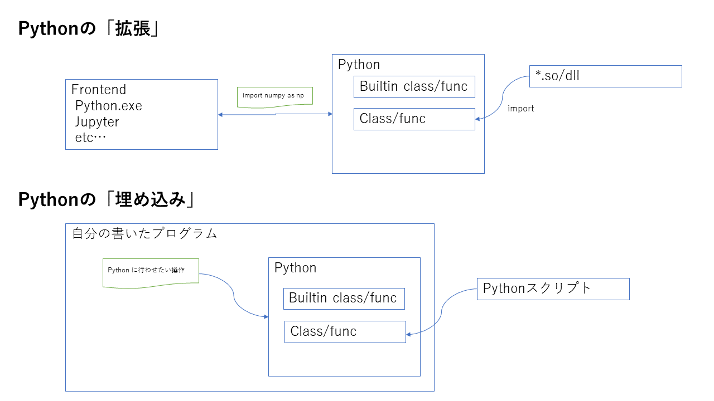
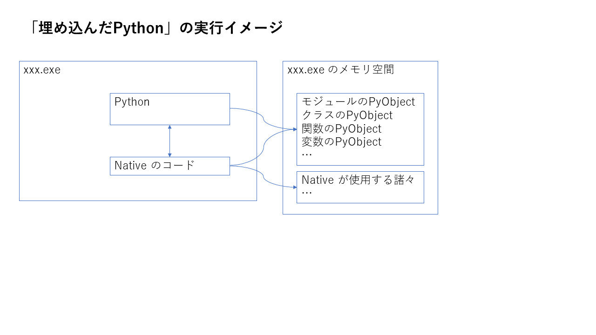
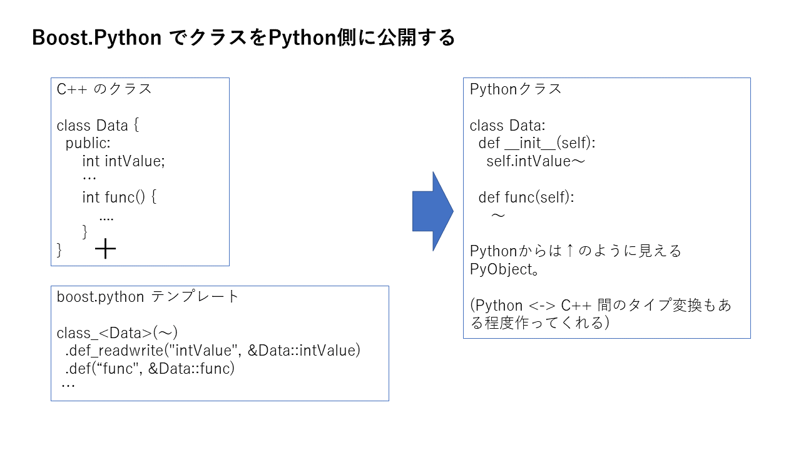

# ネイティブバイナリへの Python埋め込み

* ネイティブバイナリ(C/C++)内で PythonVM を利用する方法
* Python の内部構造について軽く
* Boost.Python を使用しての連携方法いくつか 

## Python の 「拡張」 と 「埋め込み」

  

Python から C を呼ぶのを 「**Pythonの拡張**」、C から Pythonを呼び出すのは「**Pythonの埋め込み**」と言う。

## Python公式のやり方

https://docs.python.org/ja/3/extending/embedding.html#pure-embedding

Python のみを使用して C から Python を呼び出すサンプル。
ソースを読むとなんとなく想像できる事。

* PyInitialize/PyFinalize  
  Python VMの初期化・終了。
* PyObject  
  変数も関数も全てが PyObject のポインタ。
* PyObject_XXXX, PyTuple_XXXX  
  それぞれ object, tuple の操作。
* eval()  
  stringで Pythonコードを渡して実行させる事が可能
* リファレンスカウント管理・エラー処理大変  
  全部人力ではやってられん

### ちょっと内部実装の話

  

Pythonでは全てが C 内では PyObject として見える。

https://github.com/python/cpython/tree/master/Objects

PythonVM は基本的なライブラリの層まで C で実装されており、C から直接アクセス可能。  
その為 C との連携が(比較的)やりやすい。

### Pythonを書かずにPythonを使う方法

つまり原理的には

1. PyInitialize() で Python 初期化
2. eval で呼び出す関数が定義された .py を評価させる
3. Python関数の PyObject を拾ってくる
4. PyObject_CallObject() で引っ張った関数を実行

の順で行えば C から Python のコードを直接呼び出す事ができる。

## Boost.Python

http://alpha.osdn.jp/devel/boost.python_ja.pdf

C++ <-> Python 間の言語間サポートを提供する boost のライブラリ。

* PyObject をC++から使いやすくするラッパーテンプレートの提供  
  リファレンスカウントの管理とか C <-> Python のデータ型自動変換とか
* C++のクラスと PyObject を相互変換するテンプレートの提供

ややこしい機能も色々ある(Pythonのクラスを取り込んでC++側で継承したりその逆とか)みたいですが、とりあえず自分のやりたい事が書いてある部分しか読んでいません。

### 基本的な C++ → Python 呼び出し

https://github.com/YoshikazuArimitsu/cpp_to_python/blob/master/02_boost.python/03_module

* 簡単に Python 内の object にアクセスできる
* 戻り値のPyObjectを extract する事で C++ の型に変換する
* エラー処理も簡単

### C++ のクラスを Python に公開する

https://github.com/YoshikazuArimitsu/cpp_to_python/tree/master/02_boost.python/04_export_class

BOOST_PYTHON_MODULE(モジュール名)ブロックの中に class_ テンプレートを実体化すると、C++クラスをラップした Pythonクラスが定義できる。

  

* C++内でPythonクラスのインスタンスを作成する事が可能
* 基本的な型のアトリビュート・引数・戻り値に関しては自動でコンバータを入れてくれる。  
  自分で変換したい・勝手に入れられて困る場合は自分で書く。

ちなみにこのクラスの実装のみを共有ライブラリ化し、Pythonから見える所に置くと **Pythonの拡張** として使える。

### C++のメモリ領域を直接 Python に見せる

C <-> Python で値をやりとりする時、基本的にコンバータが掛かりコピーが発生する。  
というわけでメモリを直接参照させる。

https://github.com/YoshikazuArimitsu/cpp_to_python/tree/master/02_boost.python/05_export_memoryview

Python の memoryview を生成し、Python 側に渡す事ができる。
C++側で確保したバッファを non-copy で Python から参照させる事が可能。

## 注意点

* Python 仮想環境使用時は環境変数に注意  
   (PATH, PYTHONHOME etc)
* C&Python で同じネイティブのライブラリを使用時(OpenCVとか)はバージョン・ライブラリのコンパイル環境に注意  
   (特にAnaconda)
* Python からネイティブモジュールを使用する時は更にコンパイラ等にも注意  
   (特にAnaconda)

環境の影響を激しく受けるので、真面目に業務で使うには Docker化した方が良いかも？
